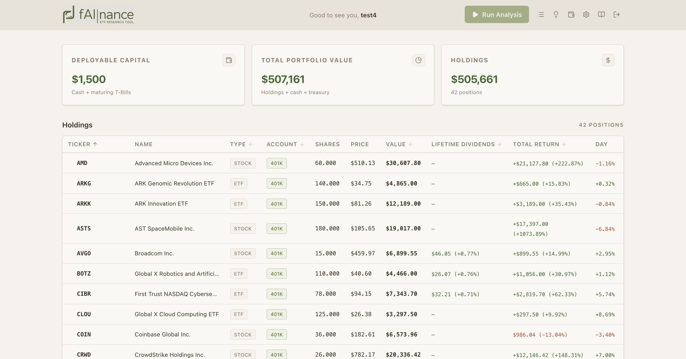
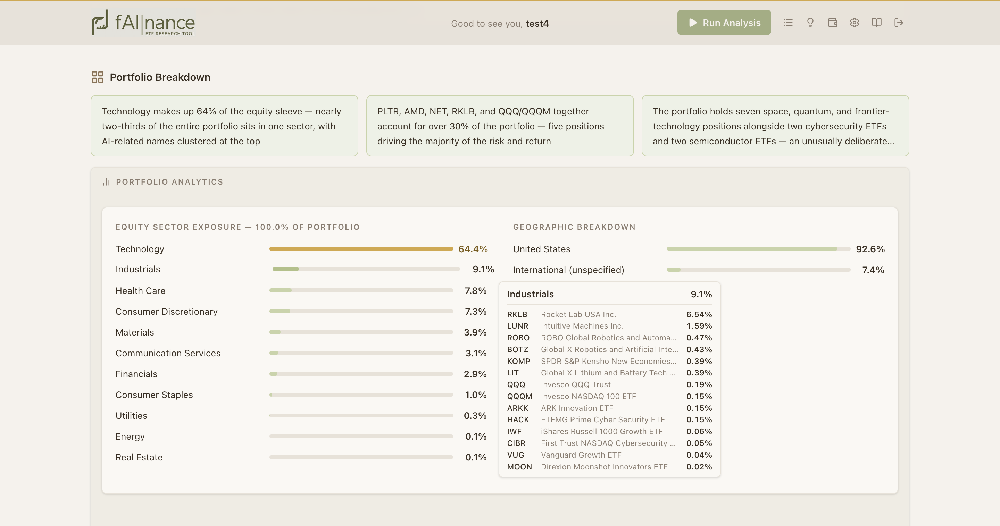
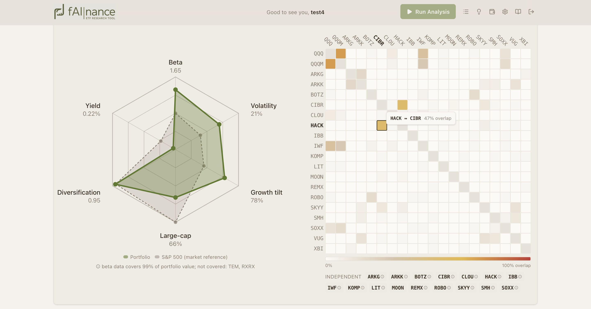
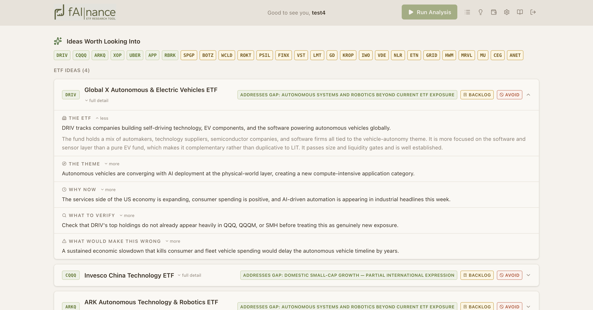

# fAInance

A personal, AI-driven portfolio-research assistant. Each run combines a quantitative read of a real portfolio with the current macro environment, then produces a structured research note: a news brief, a portfolio breakdown, risk and concentration analysis, quantitative stress scenarios, and a short list of new ETF/stock ideas anchored to gaps the analysis actually found. A follow-up chat lets you interrogate the result.

It is built for a small, closed group — me and my immediate family — not as a public product. There is no multi-tenancy, no signup flow, no marketing surface. This repository is a write-up of how it works; the application code and any real financial data live elsewhere.



> The design goal was a tool that thinks like an analyst preparing for a portfolio review: gather the numbers, read the room (macro), then form opinions that are specific to *this* portfolio rather than generic market commentary.

---

## What it does

- **Loads an encrypted profile** — holdings (lot-based, with cost basis), cash, treasuries, risk preferences, goals, an ideas backlog, and a trade log.
- **Refreshes live market data** for every position on login (price, yield, sector, beta, top holdings).
- **Assembles a macro snapshot** from several economic and market data sources.
- **Computes portfolio analytics** — sector and geographic exposure, fixed-income duration tiers, beta/volatility, factor tilts, fund overlap, and concentration metrics.
- **Calls an LLM** with a carefully structured system prompt and a data-rich user message, producing one combined research note.
- **Validates every recommendation** against quality gates using live data, and suppresses ideas surfaced in the last 30 days so the model doesn't repeat itself.
- **Renders the output** as typed, interactive UI blocks rather than a wall of text — with charts, expandable theses, and direction-tagged news topics.
- **Supports follow-up questions** via a streaming chat scoped to the session that just ran.

---

## Architecture

Two servers, deliberately kept separate.

```
┌──────────────────┐         /api/* (proxied)        ┌──────────────────┐
│  Next.js (3000)  │  ───────────────────────────▶   │   Flask (5001)   │
│  App Router UI   │                                  │  JSON API only   │
│  TypeScript      │  ◀───────────────────────────   │  no HTML render  │
└──────────────────┘            JSON / SSE            └──────────────────┘
                                                              │
                       ┌──────────────────────────────────────┼───────────────────────────┐
                       ▼                  ▼                     ▼                            ▼
                  Market data        Macro data            LLM (Claude)              Encrypted profiles
               (holdings refresh)  (FRED/News/etc.)     (analysis + chat)            (on local disk)
```

- **Frontend** — Next.js (App Router), React, TypeScript (strict), Tailwind. All UI lives here. It never talks to a market data API or the LLM directly; it only calls the backend.
- **Backend** — Flask, JSON only, bound to localhost. It runs the analysis pipeline, holds the data integrations, and owns all profile cryptography. The browser never reaches it directly — Next.js rewrites `/api/*` to it, so port 5001 is internal.

The backend is layered with no circular dependencies: pure-logic modules (analytics, prompt assembly, validation) and I/O clients (market data, macro, filings) sit at the bottom; service orchestrators compose them; the API blueprints are a thin routing layer on top. The browser-facing API surface is treated as a stable contract.

I chose the split so the two concerns could evolve independently — the UI is a fast-iterating, stateful client, while the backend is a stateless-per-request analysis engine that I can also drive from the command line without a browser.

---

## Phased build

I built this in phases, each one a self-contained increment I could run end-to-end before moving on. Roughly:

1. **Quality gates & recommendation rules** — define what makes an instrument recommendable (size, cost, liquidity) so the model operates on an open universe with guardrails rather than a hand-curated list.
2. **Output format** — design the exact shape of the research note first, as a fixed target the prompt engineering would be measured against.
3. **Profile system** — schema, encryption model, and the lot-based holdings representation.
4. **System prompt** — the analyst persona, the section-by-section output contract, and every injection point.
5. **Data sources** — the macro payload and the live market-data refresh.
6. **Core pipeline** — wire the above into a single command that produces a session file.
7. **Web interface** — the Flask JSON API and the Next.js client.
8. **Rich interface** — replace the raw-text render with a typed parser and purpose-built UI components; add the portfolio editor, trade history, backlog manager, and follow-up chat.
9. **Refinement** — performance (parallel data refresh, market-hours gating), prompt iterations, analytics quality, and UI polish.

Designing the output format (phase 2) before the prompt (phase 4) was deliberate: it turned prompt engineering into a problem with a clear target instead of an open-ended one, and it let the frontend parser and the prompt evolve against the same spec.

---

## LLM system design

The analysis is a single LLM call with a clear division of labor: a **system prompt** that defines *how* to think and what to produce, and a **user message** that carries *the data to think about*.

### Prompt architecture

The system prompt is a versioned template with two kinds of content:

- **Dynamic regions** filled per-run by a substitution engine — the user's risk dimensions, time horizon, goals, technical-knowledge level (which controls jargon density), an avoid-list, the recommendation gates, prior-session context, and data-staleness notes.
- **Literal regions** protected by sentinel markers. The template's own changelog and the verbatim instructions for reproducing the analytics block must *not* be touched by placeholder substitution, so the engine skips anything between the sentinels and strips the markers before the model sees them. This was a direct response to placeholder tokens leaking into static documentation inside the prompt.

I wrote the substitution engine rather than using a naive find-and-replace specifically to get this protected-region behavior. The output contract is strict: a fixed set of sections in a fixed order (news, portfolio breakdown, risks and concentrations, opportunity gaps, stress scenarios, backlog updates, ideas), because the frontend parses that structure deterministically.

### Macro payload assembly

The user message is built around a multi-block macro snapshot. Each block is a small, pre-formatted section — monetary policy, inflation, growth, labor, the yield curve, broad market context, headlines, an upcoming-events calendar, equity valuations, sector/factor performance, and a cross-source **conflict-detection** block that flags where the signals disagree (e.g. cooling inflation prints against hawkish Fed language).

Two design decisions matter here:

- **Fault tolerance over completeness.** Every fetch is non-blocking. If a source fails, that block becomes a clearly-marked "unavailable" string and a warning is recorded — the session still runs on whatever data came back. A flaky third-party API should never take down a research run.
- **Conflict detection as a first-class block.** Rather than dumping raw indicators and hoping the model reconciles them, I compute the divergences across sources up front and hand them over explicitly. It pushes the model toward "here's the tension in the data" instead of a confident-but-shallow summary.

Alongside the macro snapshot, the user message carries the holdings table (with the portfolio total injected as a literal figure, after the model was caught doing its own error-prone arithmetic), the full computed analytics block, the recently-recommended list for suppression, and digests of prior sessions for continuity.

### Structured output

The model returns markdown in the fixed section format, and the frontend parses it into typed structures rather than rendering it as prose. The parser is a section-marker state machine that produces a typed result — header, news update, portfolio breakdown (including the analytics block), risks/opportunities, and a list of idea theses — each of which drives a dedicated component.



The analytics block is special: its format is fixed by the backend and reproduced verbatim by the model (enforced by the prompt), so the frontend can parse it deterministically into bar charts and KPI cells. A radar/hexagon chart overlays the portfolio's profile against a market reference.



The parser is intentionally permissive. The LLM's output format drifts as the prompt evolves, so the parser carries multiple branches for older section shapes, and — critically — **falls back to rendering raw markdown whenever it can't confidently parse**. A format change degrades the UI to plain text; it never crashes it. The news section, for example, renders direction-tagged topic pills when the structured format is present and falls back to prose otherwise.



Each idea is an expandable card: a one-line summary always visible, with the full thesis (the case, why now, what to verify, what would break it) behind a toggle, and a link back to the portfolio gap it addresses.

### Recommendation gates and validation

The model recommends from an open universe, but every recommendation is checked. Quality gates — defined as runtime configuration, overridable per profile — set thresholds for what's recommendable:

- **ETFs:** minimum assets under management, maximum expense ratio, minimum listing age, and blocks on leveraged/inverse products.
- **Stocks:** minimum market cap, minimum average daily dollar volume, minimum listing age, and blocks on OTC and non-US-listed names.

After generation, each recommended ticker is looked up against live data and validated against the appropriate gates. Failures aren't silently dropped — the model's output is preserved in full, with a visible flag inserted under any thesis that fails a gate. The reasoning stays auditable; the user just sees clearly when an idea doesn't clear the bar.

Passing recommendations are recorded to a per-profile index. On the next run, anything surfaced in the last 30 days is injected into the prompt as a suppression list, so the tool keeps proposing fresh ideas instead of recycling last week's.

### Follow-up chatbot

After a run, the session output and the data that produced it are saved as context. A follow-up chat streams responses token-by-token (server-sent events) and is scoped to that session — you can ask why a recommendation was made, push back on a risk call, or explore a "what if." The system prompt for chat is rebuilt fresh from the in-memory profile on each request rather than persisted, because it contains sensitive profile data.

The same LLM (Anthropic's Claude) powers the analysis run, the secondary "more ideas" generation, and the chat. During the analysis run the model has access to a web-search tool — capped at a small number of uses to bound cost — used narrowly to surface developing stories for the news watchlist. A separate, smaller model is used only for an optional one-line narrative summary on prior-session digests; that call is fully fault-tolerant and the digest survives without it.

---

## Data integrations

The tool pulls from several external sources, each wrapped in its own client with timeouts and graceful degradation:

- **Market data (holdings refresh)** — live price, yield, day change, sector, beta, and fund composition for every position. Refreshed in parallel on a worker pool so wall-clock time is bounded by the slowest single holding, not their sum. A market-hours gate and a same-day fast path skip redundant network calls when prices can't have changed; failed or timed-out holdings are marked stale and the dashboard shows a staleness indicator rather than blocking.
- **Economic data (FRED)** — the backbone of the macro snapshot: policy rates, inflation, growth, labor, the yield curve, and credit spreads.
- **News** — headlines for the macro brief and supplementary color the economic series don't capture.
- **SEC EDGAR (fund holdings)** — for deeper fund composition than the market-data API exposes, parsed from funds' regulatory portfolio filings. Large filings are streamed rather than loaded whole, and results are disk-cached per ticker with a TTL. Resolving a fund ticker to the correct filing entity turned out to be the hard part — filings are archived under the fund trust, not the third-party agent that submits them — so the lookup is a multi-tier search that falls back through several discovery strategies and caches what it finds.

The unifying principle across all of these: **no external fetch is allowed to block or break a session.** Every integration surfaces failures as warnings and staleness flags, and the pipeline always completes with whatever data it has.

---

## Security & data handling

This tool holds real family financial data, so the data model is built around keeping it private and local.

- **Profiles are encrypted at rest** using standard, well-vetted libraries (bcrypt, Argon2id, Fernet) rather than hand-rolled cryptography. Each profile is stored as ciphertext on local disk and is never committed to version control.
- **The encryption key lives only in memory.** It's derived from the password at login, held in process for the session so edits can be re-encrypted, and never written to disk, logged, or returned over the API. A forgotten password means an unrecoverable profile — by design.
- **Sensitive content stays out of logs and responses.** Decrypted profile contents, raw keys, and passwords are never logged or sent to the client. Account numbers and other identifiers are kept out of the data model entirely.
- **Brute-force protection** — repeated failed logins are rate-limited with a lockout.
- **The backend is internal-only.** It binds to localhost and is reachable solely through the frontend proxy; it renders no HTML and exposes only a JSON API.

Derived figures (gains, returns, weights) are computed at runtime rather than stored, and the lot-level cost basis is treated as the source of truth and never silently overwritten — corporate actions are flagged for the user to resolve, never auto-applied.

---

## Tech stack

**Backend:** Python, Flask, the Anthropic SDK for the LLM (with a secondary model for an optional digest line), plus market-data, FRED, news, and SEC EDGAR clients. Cryptography via bcrypt, Argon2id, and Fernet.

**Frontend:** Next.js (App Router), React, TypeScript (strict mode), Tailwind, with a custom typed parser turning LLM markdown into interactive components.

---

*This README describes a personal project. All screenshots use scrubbed, non-real data; no real holdings, balances, account names, or tickers appear anywhere in this repository.*
